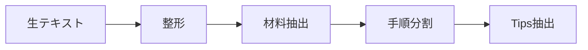
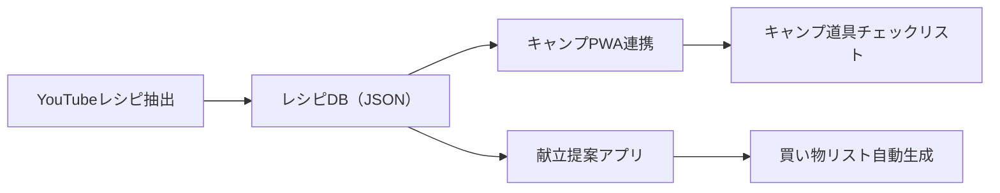

# YouTubeレシピ抽出PWA - 実装計画

> [!NOTE]
> このドキュメントは `docs/development_workflow.md` に従って管理されています。
> 目的・スコープ・制約の変更は人間の承認が必要です。

## プロジェクト概要

### 背景と課題
- YouTubeのレシピ動画は便利だが、調理中に動画がどんどん進んでしまい使いにくい
- テキストだけのレシピは視覚的にわかりにくい
- 複数のレシピを整理・管理したい

### ソリューション
YouTubeレシピ動画から手順を**自動抽出**し、**ステップカード形式**で表示するPWA。
自分のペースで進められ、キッチンでスマホ/タブレットから快適に使える。

### 主な特徴
| 特徴 | 説明 |
|------|------|
| 🎥 自動抽出 | YouTube URLから字幕を取得し、AIでレシピを構造化 |
| 📝 テキスト入力 | 字幕取得失敗時はテキスト貼り付けでも解析可能 |
| 📱 モバイル最適化 | キッチンでの使用を想定したUI |
| ✏️ 手動編集 | 抽出結果を後から修正可能（MVP時点で対応） |
| 💾 データ保存 | JSONでGitHubに保存、複数端末で共有可能 |
| 🔌 オフライン | PWAでオフライン時も閲覧可能 |

---

## 技術スタック

| 項目 | 技術 | 理由 |
|------|------|------|
| フロントエンド | Vanilla JS + Vite | 軽量、HMR対応、PWA向き |
| 字幕取得 | YouTube Transcript API（プロキシ経由） | CORS対策が必要 |
| レシピ解析 | Gemini API | 高精度なテキスト解析 |
| ローカル保存 | IndexedDB | 大容量データ対応 |
| 永続保存 | GitHub JSON | 既存方式との一貫性 |
| ホスティング | GitHub Pages | 無料、簡単デプロイ |

### プロキシ実装方針
> [!NOTE]
> 字幕取得のプロキシは以下の選択肢を検討：
> - **Cloudflare Workers**（無料枠あり、推奨）
> - Vercel Edge Functions
> - 自前のシンプルなNode.jsサーバー
>
> 初期は問題発生時に都度対応する方針とし、必要に応じて代替策に切り替える。

### APIキー管理
> [!IMPORTANT]
> Gemini APIキーはコードにハードコードしない。
> - **開発時**: ユーザーがUI上で直接入力（LocalStorageに保存）
> - **本番時**: 入力済みのキーをLocalStorageから利用
> - セキュリティ上、暗号化保存も将来検討

---

## リスクと対策

> [!WARNING]
> 以下のリスクを認識した上で開発を進める。

| リスク | 影響 | 対策 |
|--------|------|------|
| YouTube字幕APIの不安定性 | 字幕取得失敗 | テキスト貼り付けのフォールバックUIを用意 |
| 日本語自動字幕の精度不足 | 解析結果が壊れる | 編集機能をMVPに含め、手動修正可能に |
| Gemini APIのハルシネーション | 分量・手順の誤り | 段階的処理 + 編集機能で対応 |
| 動画に字幕自体がない | 何も抽出できない | 概要欄や手動入力で代替 |

---

## データ設計

### レシピデータ構造（JSON）

```json
{
  "id": "recipe_20260201_001",
  "title": "ふわふわパンケーキ",
  "sourceUrl": "https://www.youtube.com/watch?v=xxxxx",
  "sourceType": "youtube",
  "thumbnailUrl": "https://img.youtube.com/vi/xxxxx/maxresdefault.jpg",
  "category": "sweets",
  "tags": ["朝食", "デザート", "簡単"],
  "servings": "2人分",
  "prepTime": "10分",
  "cookTime": "15分",
  "ingredients": [
    { "name": "薄力粉", "amount": "150", "unit": "g" },
    { "name": "卵", "amount": "2", "unit": "個" },
    { "name": "牛乳", "amount": "100", "unit": "ml" }
  ],
  "steps": [
    {
      "order": 1,
      "description": "ボウルに卵と砂糖を入れて、白っぽくなるまで混ぜる",
      "timestamp": "1:23",
      "tips": "ハンドミキサーを使うと楽",
      "imageUrl": null
    },
    {
      "order": 2,
      "description": "薄力粉をふるい入れ、さっくり混ぜる",
      "timestamp": "2:45",
      "tips": "混ぜすぎ注意",
      "imageUrl": null
    }
  ],
  "notes": "焼き色がついたらすぐに返すのがコツ",
  "createdAt": "2026-02-01T13:00:00+09:00",
  "updatedAt": "2026-02-01T13:00:00+09:00"
}
```

### カテゴリ
- `camp` - キャンプ料理
- `sweets` - お菓子・ケーキ
- `daily` - 日常の食事
- `other` - その他

---

## UI設計

### 画面構成

```
┌─────────────────────────────────────────┐
│  📖 レシピノート                    ⚙️   │  ← ヘッダー（設定ボタン）
├─────────────────────────────────────────┤
│                                         │
│  ┌─────────────────────────────────┐   │
│  │ 🔗 YouTube URLを貼り付け...      │   │  ← URL入力
│  └─────────────────────────────────┘   │
│                                         │
│  ┌─────────────────────────────────┐   │
│  │ 📝 または、テキストを貼り付け... │   │  ← フォールバック入力
│  └─────────────────────────────────┘   │
│                                         │
│  ━━━━━━━━━━━━━━━━━━━━━━━━━━━━━━━━━━━━  │
│                                         │
│  【 最近のレシピ 】                      │
│                                         │
│  ┌────────┐ ┌────────┐ ┌────────┐     │
│  │ 🥞     │ │ 🍰     │ │ 🍳     │     │  ← レシピカード
│  │パンケーキ │ │チーズケーキ│ │ オムレツ │     │
│  └────────┘ └────────┘ └────────┘     │
│                                         │
└─────────────────────────────────────────┘
```

### 設定画面（APIキー入力）

```
┌─────────────────────────────────────────┐
│  ← 設定                                 │
├─────────────────────────────────────────┤
│                                         │
│  【 Gemini API 】                       │
│                                         │
│  ┌─────────────────────────────────┐   │
│  │ 🔑 APIキーを入力...              │   │
│  └─────────────────────────────────┘   │
│                                         │
│  ┌───────────────┐                     │
│  │   保存        │                     │
│  └───────────────┘                     │
│                                         │
│  💡 APIキーはブラウザに保存されます     │
│                                         │
└─────────────────────────────────────────┘
```

### ステップ表示画面

```
┌─────────────────────────────────────────┐
│  ← ふわふわパンケーキ              ✏️   │  ← タイトル + 編集ボタン
├─────────────────────────────────────────┤
│                                         │
│   Step 2 / 5                            │  ← 進捗表示
│   ●●○○○                                │
│                                         │
│  ┌─────────────────────────────────┐   │
│  │                                 │   │
│  │      [サムネイル/GIF]           │   │  ← ビジュアル
│  │                                 │   │
│  └─────────────────────────────────┘   │
│                                         │
│  薄力粉をふるい入れ、                   │
│  さっくり混ぜる                         │  ← 手順テキスト
│                                         │
│  💡 混ぜすぎ注意                        │  ← ポイント
│                                         │
│  ▶️ 2:45 で再生                        │  ← 動画リンク
│                                         │
│  ┌─────────┐         ┌─────────┐      │
│  │  ◀ 前へ │         │ 次へ ▶ │      │  ← ナビゲーション
│  └─────────┘         └─────────┘      │
│                                         │
└─────────────────────────────────────────┘
```

---

## 段階的実装計画

### Phase 1: プロジェクト基盤

**目標**: Viteプロジェクト初期化、デザインシステム構築

#### 実装内容
1. Viteプロジェクトのセットアップ
2. 基本HTML/CSS（デザインシステム）
3. PWA設定（manifest.json）
4. レスポンシブレイアウト

### Phase 2: MVP（テキスト入力ベース）

**目標**: テキスト入力 → レシピ解析 → 表示 → 基本編集

> [!IMPORTANT]
> MVPでは**字幕取得を後回し**にし、まず「テキスト入力 → Gemini解析 → 表示」の流れを確立する。
> これにより、字幕API問題に左右されずにコア価値を検証できる。

#### プロジェクト構造
```
recipe-extractor/
├── index.html
├── src/
│   ├── main.js          # エントリーポイント
│   ├── app.js           # メインアプリケーション
│   ├── gemini.js        # Gemini API連携
│   ├── recipe.js        # レシピデータ管理
│   ├── storage.js       # IndexedDB操作
│   └── settings.js      # 設定管理（APIキー等）
├── css/
│   └── styles.css
├── manifest.json
├── sw.js                # Service Worker
└── vite.config.js
```

#### 実装順序
1. **設定画面** - APIキー入力UI、LocalStorage保存
2. **テキスト入力UI** - 字幕/概要欄を貼り付ける入力エリア
3. **Gemini APIでレシピ解析** - プロンプトエンジニアリング
4. **ステップカード表示** - 抽出結果の表示
5. **基本編集機能** - 手順テキストの修正（最低限）
6. **IndexedDBへ保存** - ローカル永続化

### Phase 3: 字幕取得 & 自動化

- [ ] YouTube字幕取得機能（プロキシ経由）
- [ ] URL入力 → 自動で字幕取得 → 解析 のフロー
- [ ] 字幕取得失敗時のフォールバックUI
- [ ] Gemini責務の分割（整形→材料抽出→手順分割）

### Phase 4: 編集・管理機能強化

- [ ] レシピ編集機能（材料・手順の追加/削除/並び替え）
- [ ] カテゴリ・タグ管理
- [ ] レシピ一覧の検索・フィルタ

### Phase 5: GitHub連携 & オフライン

- [ ] JSON形式でエクスポート/インポート
- [ ] GitHubリポジトリへの保存ガイド
- [ ] Service Workerによるオフライン対応
- [ ] PWAインストール対応

---

## Gemini API設計

### 段階的処理（推奨）

字幕テキストを一度に全解析するのではなく、段階的に処理：



各段階で結果を確認・デバッグできるため、問題の切り分けが容易になる。

### プロンプト設計方針

1. **明確な出力形式指定**: JSON形式で出力させる
2. **失敗を許容**: 「不明な場合は空文字列」のような指示
3. **料理用語の補完**: 日本語字幕の誤りを想定した補正

---

## 将来の拡張構想



### 連携のポイント
- **共通データ形式**: すべてのアプリで同じレシピJSON形式を使用
- **カテゴリでフィルタ**: キャンプPWAは `category: "camp"` のみ表示
- **献立提案**: レシピDBから条件に合うものを提案

### 将来検討事項（Phase 6以降）
- 音声操作（「次」「戻って」）- Web Speech API
- ジェスチャー操作 - 手が汚れている時用
- 他ユーザーとのレシピ共有

---

## 検証計画

### 自動テスト
- Gemini API応答のパース確認
- IndexedDB CRUD操作の確認
- （Phase 3以降）YouTube字幕取得のテスト

### 手動検証
- スマホ実機でのUI確認（ローカルHTTPS + mkcert）
- 画面分割モードでの動作確認
- オフライン時の動作確認

---

## 開発ワークフロー

> [!NOTE]
> `docs/development_workflow.md` に従って開発を進めます。

### 作業フロー
1. Phase 1 実装 → `/backup` (Gitea)
2. ローカル確認（npm run dev）
3. Phase 2 実装 → `/backup`
4. `/export-context` → AIレビュー依頼
5. `/review-feedback` → 修正
6. 公開準備完了 → `/publish` (GitHub)

---

## 次のステップ

> [!IMPORTANT]
> このプランを承認後、Phase 1 から開発を開始します。

1. ✅ このプランのレビュー・承認
2. ⏳ Phase 1: Vite プロジェクトセットアップ
3. ⏳ Phase 2: MVP実装（テキスト入力 → 解析 → 表示）
