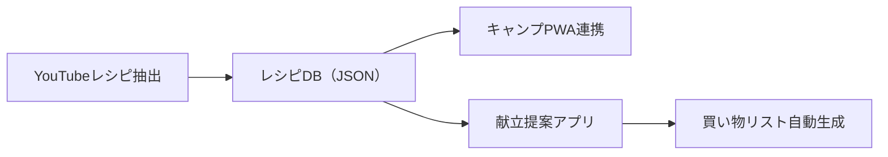

# YouTubeレシピ抽出 - 実装計画

> [!NOTE]
> このドキュメントは `docs/development_workflow.md` に従って管理されています。
> 目的・スコープ・制約の変更は人間の承認が必要です。

## プロジェクト概要

### 背景と課題
- YouTubeのレシピ動画は便利だが、調理中に動画がどんどん進んでしまい使いにくい
- テキストだけのレシピは視覚的にわかりにくい
- 複数のレシピを整理・管理したい

### ソリューション
YouTubeレシピ動画から手順を**自動抽出**し、**ステップカード形式**で表示するツール。
**CLI**でレシピを生成し、**PWA**でモバイル閲覧という分離アーキテクチャを採用。

### 主な特徴
| 特徴 | 説明 |
|------|------|
| 🎥 自動抽出 | YouTube URLからyt-dlpで字幕取得、AIでレシピを構造化 |
| 📱 モバイル最適化 | キッチンでの使用を想定したPWAビューワー |
| 🎬 動画埋め込み | 各ステップにYouTube動画を埋め込み、該当時間から再生 |
| 💾 データ保存 | JSONで一元管理、GitHubで共有可能 |

---

## アーキテクチャ

> [!IMPORTANT]
> **Phase 4で再設計**: CLI（レシピ生成）+ PWA（ビューワー）の分離構成に移行。
> CORS制限やAPIキー管理の問題をCLI側で解決。

```
┌─────────────────────────────────────────────────────────────────┐
│                        PC / サーバー                             │
│  ┌─────────────┐    ┌─────────────┐    ┌─────────────────────┐ │
│  │  YouTube    │───▶│   yt-dlp    │───▶│ Gemini API          │ │
│  │  (URL)      │    │ (字幕取得)   │    │ (レシピ構造化)       │ │
│  └─────────────┘    └─────────────┘    └─────────────────────┘ │
│                                               │                 │
│                                               ▼                 │
│                                    ┌─────────────────────┐     │
│                                    │  public/recipes.json │     │
│                                    └─────────────────────┘     │
└───────────────────────────────────────────│─────────────────────┘
                                            │
                                            ▼
┌───────────────────────────────────────────────────────────────┐
│                      スマホ / ブラウザ                         │
│  ┌─────────────────────────────────────────────────────────┐  │
│  │                  PWA ビューワー                         │  │
│  │  ┌────────────────────────────────────────────────────┐ │  │
│  │  │  📋 レシピ一覧  →  📖 ステップ表示（動画埋め込み）    │ │  │
│  │  └────────────────────────────────────────────────────┘ │  │
│  └─────────────────────────────────────────────────────────┘  │
└───────────────────────────────────────────────────────────────┘
```

---

## 技術スタック

| 項目 | 技術 | 理由 |
|------|------|------|
| フロントエンド | Vanilla JS + Vite | 軽量、HMR対応、PWA向き |
| 字幕取得 | yt-dlp (CLI) | 最も信頼性が高い字幕抽出ツール |
| レシピ解析 | Gemini API | 高精度なテキスト解析 |
| データ形式 | JSON (静的ファイル) | シンプル、Git管理可能 |
| ホスティング | GitHub Pages | 無料、簡単デプロイ |

### APIキー管理
> [!IMPORTANT]
> Gemini APIキーは `cli/config.json` で管理。
> - `config.json` は `.gitignore` で除外
> - `config.json.example` をテンプレートとして提供

---

## データ設計

### レシピデータ構造（JSON）

```json
{
  "id": "recipe_1769940460110",
  "title": "ふわふわパンケーキ",
  "sourceUrl": "https://www.youtube.com/watch?v=xxxxx",
  "sourceType": "youtube",
  "thumbnailUrl": "https://img.youtube.com/vi/xxxxx/maxresdefault.jpg",
  "category": "sweets",
  "tags": ["朝食", "デザート", "簡単"],
  "servings": "2人分",
  "prepTime": "10分",
  "cookTime": "15分",
  "ingredients": [
    { "name": "薄力粉", "amount": "150", "unit": "g" }
  ],
  "steps": [
    {
      "order": 1,
      "description": "ボウルに卵と砂糖を入れて、白っぽくなるまで混ぜる",
      "timestamp": "1:23",
      "tips": "ハンドミキサーを使うと楽"
    }
  ],
  "notes": "焼き色がついたらすぐに返すのがコツ",
  "createdAt": "2026-02-01T13:00:00+09:00",
  "updatedAt": "2026-02-01T13:00:00+09:00"
}
```

### カテゴリ
- `camp` - キャンプ料理
- `sweets` - お菓子・ケーキ  
- `daily` - 日常の食事
- `other` - その他

---

## プロジェクト構造

```
recipe-extractor/
├── index.html           # PWA エントリーポイント
├── src/
│   ├── main.js          # アプリ初期化
│   ├── app.js           # PWAビューワーロジック
│   ├── settings.js      # ユーティリティ（トースト等）
│   └── css/
│       └── styles.css
├── public/
│   └── recipes.json     # レシピデータ（CLI出力）
├── cli/
│   ├── index.js         # CLIメインスクリプト
│   ├── config.json      # APIキー設定（.gitignore）
│   ├── config.json.example
│   └── package.json
├── manifest.json
└── vite.config.js
```

---

## 段階的実装計画

### Phase 1-3: 基盤〜MVP ✅

Phase 1〜3は完了。Viteセットアップ、デザインシステム、基本的なテキスト入力→解析→表示の流れを構築。

### Phase 4: アーキテクチャ再設計 ✅

**完了済み**

#### CLI（レシピ生成）
- [x] yt-dlp統合によるYouTube字幕自動取得
- [x] VTTパース（タイムスタンプ付き）  
- [x] Gemini APIでのレシピ構造化
- [x] `public/recipes.json` への保存

#### PWA（ビューワー）
- [x] `recipes.json` からの読み込み専用に変更
- [x] レシピ一覧表示（サムネイル付き）
- [x] YouTube動画埋め込み（各ステップ）
- [x] タイムスタンプ連動再生

### Phase 5: 管理機能強化 🔜

- [ ] レシピ検索・フィルタリング
- [ ] カテゴリ別表示
- [ ] レシピ削除機能
- [ ] 並び替え（新しい順/カテゴリ順）

### Phase 6: オフライン & 配信

- [ ] Service Workerによるオフライン対応
- [ ] PWAインストール対応
- [ ] GitHub Pagesへの静的デプロイ

---

## CLIの使い方

```bash
cd cli

# レシピを抽出
node index.js https://www.youtube.com/watch?v=xxxxxx

# 登録済みレシピ一覧
node index.js --list

# 設定確認
node index.js --config
```

---

## 将来の拡張構想



### 将来検討事項（Phase 7以降）
- 音声操作（「次」「戻って」）
- ジェスチャー操作
- 他ユーザーとのレシピ共有
- PWA側での編集機能
